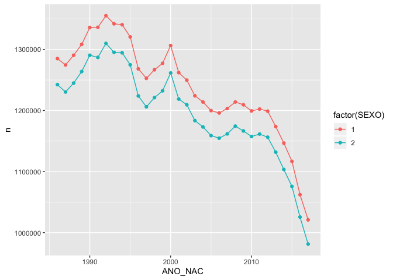

Ejemplo de consulta y exploración
================

``` r
library(tidyverse)
```

    ## ── Attaching packages ────────────────────────────────────────────────────────── tidyverse 1.2.1 ──

    ## ✔ ggplot2 3.2.1     ✔ purrr   0.3.3
    ## ✔ tibble  2.1.3     ✔ dplyr   0.8.3
    ## ✔ tidyr   1.0.0     ✔ stringr 1.4.0
    ## ✔ readr   1.3.1     ✔ forcats 0.4.0

    ## ── Conflicts ───────────────────────────────────────────────────────────── tidyverse_conflicts() ──
    ## ✖ dplyr::filter() masks stats::filter()
    ## ✖ dplyr::lag()    masks stats::lag()

``` r
# autenticar con
# bigrquery::bq_auth(use_oob = TRUE)
# este debe quedarse fijo:
proyecto_dset <- "decent-oxygen-259223"
# cambiar billing a tu cuenta:
billing <-  "decent-oxygen-259223"
# conectar
con <- DBI::dbConnect(
  bigrquery::bigquery(),
  project = proyecto_dset,
  dataset = "natalidad_mexico_1985_2017",
  billing = billing
)
```

``` r
nac_tbl <- tbl(con, "nacimientos")
```

    ## Using an auto-discovered, cached token.
    ## To suppress this message, modify your code or options to clearly consent to the use of a cached token.
    ## See gargle's "Non-interactive auth" vignette for more details:
    ## https://gargle.r-lib.org/articles/non-interactive-auth.html
    ## The bigrquery package is using a cached token for felipexgonzalez@gmail.com.

``` r
total_año_reg <- nac_tbl %>% group_by(ANO_REG) %>% tally() %>% collect()
total_año_reg %>% arrange(ANO_REG)
```

    ## # A tibble: 34 x 2
    ##    ANO_REG       n
    ##      <int>   <int>
    ##  1    1985 2655571
    ##  2    1986 2579301
    ##  3    1987 2794390
    ##  4    1988 2622031
    ##  5    1989 2620262
    ##  6    1990 2735312
    ##  7    1991 2756447
    ##  8    1992 2797397
    ##  9    1993 2839686
    ## 10    1994 2904389
    ## # … with 24 more rows

``` r
nacimientos_año <- nac_tbl %>% 
  group_by(ANO_NAC, SEXO) %>% tally() %>% collect()
nac_anual <- nacimientos_año %>% 
  filter(ANO_NAC > 1985, ANO_NAC <= 2017) %>% 
  arrange(ANO_NAC)
```

``` r
ggplot(nac_anual %>% filter(SEXO!=9), 
       aes(x = ANO_NAC, y = n, colour = factor(SEXO), group = SEXO)) + 
  geom_point() + geom_line() 
```

<!-- -->
